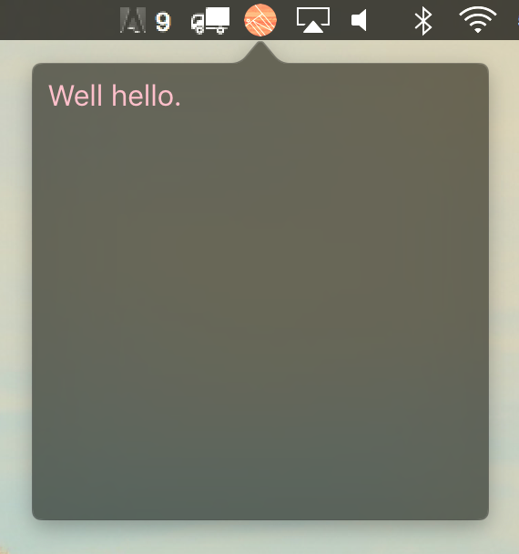

# Creating a status bar app in Tint #

This example shows how to use the [StatusBar](http://www.trueinteractions.com/tint2/docs/StatusBar.html), [WebView](http://www.trueinteractions.com/tint2/docs/WebView.html) and [PopOver](http://www.trueinteractions.com/tint2/docs/PopOver.html) component to produce a simple utility mounted to the taskbar or system tray on the host operating system.



## What does it do ? ##

1. Creates a background application, so our icon doesn't sit in the dock.
2. Creates a new statusbar, when clicked, it opens the pop over window over the status bar. 
3. Creates a transparent background webview and renders the html in index.html on the popover. 

## How do i run it? ##

1. Clone down this repo.
2. Install tint from https://github.com/trueinteractions/tint2/releases
3. At the command line run ```tint main.js``` in the cloned repo.
4. Have fun! Read about Tint in more depth at: https://www.trueinteractions.com/docs/